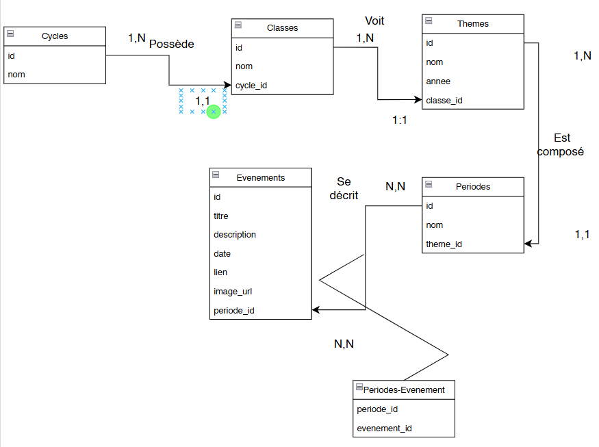

# Projet Backend - Gestion des Événements

Ce projet implémente un système de gestion des événements avec une base de données relationnelle. Il inclut des opérations CRUD (Create, Read, Update, Delete) pour la gestion des événements, ainsi que des relations entre les entités (événements, périodes). Les commentaires destinés à la compréhension du code sont essentiellement réunis sur une même gamme de fichier(exemple: event).

## Table des matières
- [Instructions de démarrage](#instructions-de-démarrage)
- [Conception de la base de données](#conception-de-la-base-de-données)
- [Relations entre les entités](#relations-entre-les-entités)
- [Requêtes SQL pour les opérations CRUD](#requêtes-sql-pour-les-opérations-crud)
- [MCD](#relations-entre-les-entités)
- [MLD](...)

## Instructions de démarrage

### Prérequis
1. Node.js (version 14 ou supérieure)
2. SQLite ou PostgreSQL pour la base de données (SQLite est utilisé par défaut dans ce projet)

### Étapes d'installation

1. Clonez ce répertoire :
    ```bash
    git clone https://github.com/LgTechh/ECF-BackEnd.git
    ```

2. Accédez au dossier du projet :
    ```bash
    cd ECF-BackEnd
    ```

3. Installez les dépendances :
    ```bash
    npm install
    ```

4. Créez ou configurez votre base de données (voir la section "Conception de la base de données").

5. Démarrez l'application :
    ```bash
    npm start
    ```

   L'API sera accessible sur [http://localhost:3001](http://localhost:3001).

### Configuration de la base de données
- Par défaut, SQLite est utilisé avec un fichier `database.db`. Si vous préférez utiliser PostgreSQL ou une autre base, modifiez la configuration dans `config/db.js`.
- Assurez-vous que votre base de données contient les bonnes tables (voir la section "Conception de la base de données").

### Endpoints disponibles
- **GET** `/api/events`: Récupérer tous les événements
- **GET** `/api/events/:id`: Récupérer un événement par son ID
- **GET** `/api/events?periodeId= ?`: Récupérer les événements par période
- **GET** `/api/periodes`: Récupérer toutes les périodes
- **GET** `/api/periodes?themeId = ?` Récupérer les périodes par leur thème
- **POST** `/api/events`: Créer un nouvel événement
- **PUT** `/api/events/:id`: Mettre à jour un événement existant
- **DELETE** `/api/events/:id`: Supprimer un événement

## Conception de la base de données

Le projet utilise une base de données relationnelle avec les tables suivantes :

# 📋 Tables

#### 1. **Cycles (Cycle)** 🔄
* `id` (INTEGER, clé primaire)
* `nom` (TEXT, non null)

#### 2. **Classes (Classe)** 👨‍🎓
* `id` (INTEGER, clé primaire)
* `nom` (TEXT, non null)
* `cycle_id` (INTEGER, non null, clé étrangère référencée par la table `Cycle`)

#### 3. **Thèmes (Theme)** 📝
* `id` (INTEGER, clé primaire)
* `nom` (TEXT, non null)
* `annee` (TEXT)
* `classe_id` (INTEGER, non null, clé étrangère référencée par la table `Classe`)

#### 4. **Périodes (Periode)** ⏳
* `id` (INTEGER, clé primaire)
* `nom` (TEXT, non null)
* `theme_id` (INTEGER, non null, clé étrangère référencée par la table `Theme`)

#### 5. **Événements (Evenement)** 📅
* `id` (INTEGER, clé primaire)
* `titre` (TEXT, non null)
* `description` (TEXT)
* `date` (TEXT)
* `lien` (TEXT)
* `image_url` (TEXT)
* `periode_id` (INTEGER, non null, clé étrangère référencée par la table `Periode`)

#### 6. **Association Evenements - Periode (Evenement_Periode)** 🔗
* `periode_id` (INTEGER, non null, clé primaire, clé étrangère référencée par la table `Periode`)
* `evenement_id` (INTEGER, non null, clé primaire, clé étrangère référencée par la table `Evenement`)

## 🔄 Relations entre les Tables

### 🌳 Hiérarchie Principale
1. **Cycle** contient une ou plusieurs **Classes**
2. **Classe** est associée à un ou plusieurs **Thèmes**
3. **Thème** est divisé en une ou plusieurs **Périodes**
4. **Période** contient un ou plusieurs **Événements**

### 🔗 Relations Spécifiques
- Un **Cycle** peut avoir plusieurs **Classes** (relation 1-n)
- Une **Classe** appartient à un seul **Cycle** (relation 1-1)
- Une **Classe** peut avoir plusieurs **Thèmes** (relation 1-n)
- Un **Thème** appartient à une seule **Classe** (relation 1-1)
- Un **Thème** peut avoir plusieurs **Périodes** (relation 1-n)
- Une **Période** appartient à un seul **Thème** (relation 1-1)
- Une **Période** peut avoir plusieurs **Événements** (relation N-N)
- Un **Événement** appartient à une ou plusieurs périodes **Période** (relation N-N)

### 🔄 Association Many-to-Many
- La table de jonction **Periode_Evenement** établit une relation many-to-many entre **Periodes** et **Événements**
   - Un **Événement** peut être associé à plusieurs **Périodes**
   - Une **Période** peut être associée à plusieurs **Événements**

# 🧙‍♂️ Requête SQL utilisées dans ce projet : 

### 💻 - Récupérer tous les événements
```sql
SELECT * FROM Evenement;
```
### 💻 - Récupérer un événements par ID
```sql
SELECT * FROM Evenement WHERE id = ?;
```
### 💻 - Récupérer les événements par période
```sql
SELECT Evenement.*, Periode.nom AS periode_nom
FROM Evenement
         INNER JOIN Periode ON Evenement.periode_id = Periode.id
WHERE Evenement.periode_id = ?;
```
### 💻 - Créer un événement
```sql
INSERT INTO Evenement (titre, description, date, lien, image_url, periode_id)
VALUES (?, ?, ?, ?, ?, ?);
```
### 💻 - Mettre à jour un événement
```sql
UPDATE Evenement
SET titre = ?, description = ?, date = ?, lien = ?, image_url = ?, periode_id = ?
WHERE id = ?;
```
### 💻 - Supprimer un événement
```sql
DELETE FROM Evenement WHERE id = ?;
```
## 🧙‍♂️ Requête périodes

### 💻 - Récupérer toutes les périodes 
```sql
SELECT * FROM Periode;
```
### 💻 - Récupérer les périodes en fonction de leur thème
```sql
SELECT
   Periode.id,
   Periode.nom,
   Periode.theme_id,
   Theme.nom AS theme_nom,
   Theme.annee AS theme_annee
FROM
   Theme
      INNER JOIN
   Periode ON Theme.id = Periode.theme_id
WHERE
   Theme.id = ?
```

## ✒️MCD


## MLD

```sql
Table Cycles {
  id int [pk, increment]
  nom varchar
}

Table Classes {
  id int [pk, increment]
  nom varchar
  cycle_id int [ref: > Cycles.id]
}

Table Themes {
  id int [pk, increment]
  nom varchar
  annee varchar
  classe_id int [ref: > Classes.id]
}

Table Periodes {
  id int [pk, increment]
  nom varchar
  theme_id int [ref: > Themes.id]
}

Table Evenements {
  id int [pk, increment]
  titre varchar
  description text
  date date
  lien varchar
  image_url varchar
}

Table Periodes_Evenement {
  periode_id int [ref: > Periodes.id]
  evenement_id int [ref: > Evenements.id]
}

```